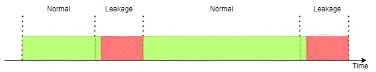

# Anticipating the Future: Predictive Maintenance for Public Transportation

## MOTIVATION
Predictive maintenance (PdM) plays a crucial role in today’s industrial landscape, supporting the principles of operational efficiency and environmental sustainability. In an era marked by increasing reliance on complex machinery and
equipment, the ability to foresee and prevent mechanical failures is of utmost importance. This importance is highlighted by the significant consequences that arise from equipment malfunctions during the regular operations of public
transportation vehicles. These consequences include a range of problems such as disrupted journeys for passengers and the resulting disappointment. These challenges not only affect the companies managing these transportation
services but also impact the communities they serve. The adoption of innovative predictive maintenance methods holds great promise, not only in reducing travel disruptions and service interruptions but also in significantly
enhancing the overall reliability and satisfaction associated with public transportation systems. Therefore, tackling this formidable challenge serves as a catalyst not only for technological innovation but also for the improvement of
transportation infrastructures, making them more dependable, efficient, and customer-focused.

## MATERIAL & METHODS
In the operational context of a metro train, data readings encompassing pressure, temperature, motor current, and air intake valve parameters were systematically gathered from the Air Production Unit (APU) of a compressor. The
dataset comprises a total of 15 essential features, which significantly contribute to establishing a comprehensive assessment of the health and functionality of the metro train system. This dataset serves as a valuable resource for
predicting system failures.
Within this context, our objective is to proactively predict the occurrence of both air and oil leaks. To ensure fairness in our approach, since datetime information about air leakages was provided but none was provided about oil
leakages , we employed and compared several unsupervised learning techniques, including Principal Component Analysis (PCA) coupled with K-means clustering, Isolation Forests, and Birch Clustering, to identify potential leaks.
This approach allowed us to evaluate and compare the effectiveness of unsupervised methods for both air and oil leakages, ensuring a fair assessment.
Then, we applied a Selective Sampling (SS) technique to eliminate sequences of leakage events, retaining only the initial occurrence from each sequence (Figure 1). This method results in multiple subsets of data, each consisting of a
sequence of normal working cycles that culminate in a leak event. The rationale behind this approach is to focus solely on when the leakage commenced, the contributing factors, and the feasibility of predicting its occurrence ahead
of time.

tabela aqui

## PCA WITH BIRCH CLUSTERING
Air leaks 
[Local PDF](BirchAnticipationGraphics_RF_Air.pdf)  
Oil leaks 
[Local PDF](BirchAnticipationGraphics_RF_Oil.pdf) 
## PCA WITH ISOLATION FOREST
Air leaks 
[Local PDF](IforestAnticipationGraphics_RF_Air.pdf) 
Oil leaks 
[Local PDF](IforestAnticipationGraphics_RF_Oil.pdf) 
## PCA WITH KMEANS
Air leaks 
[Local PDF](KmeansAnticipationGraphics_RF_Air.pdf) 
Oil leaks 
[Local PDF](KmeansAnticipationGraphics_RF_Oil.pdf) 

## CONTRIBUTIONS
With the conducted work, we were able to achieve the following contributions:
1. Anomaly Detection comparision using different approachs (Supervised and Unsupervised);
2. Informative Ahead of Time prevention study up to three hours in advance;
3. Selective Sampling (SS) that covers with more detail all anomalies and normal conditions while retaining a realistic imbalanced disruption ratio of examples;

## REFERENCES
–Optuna package for optimization methods -: https://optuna.org/
–KDD Poster for Competition Predictive Maintenance XPM -: https://slawomirnowaczyk.wixsite.com/ecai-xpm
–Veloso, B., Ribeiro, R. P., Gama, J., & Pereira, P. M. (2022). The MetroPT dataset for predictive maintenance. Scientific Data, 9(1), 764.
–Davari, N., Veloso, B., Ribeiro, R. P., Pereira, P. M., & Gama, J. (2021, October). Predictive maintenance based on anomaly detection using deep learning for air production unit in the railway industry. In 2021 IEEE 8th International
Conference on Data Science and Advanced Analytics (DSAA) (pp. 1-10). IEEE.
–Ribeiro, D., Matos, L. M., Moreira, G., Pilastri, A., & Cortez, P. (2022). Isolation Forests and Deep Autoencoders for Industrial Screw Tightening Anomaly Detection. Computers, 11(4), 54. MDPI AG. Retrieved from
http://dx.doi.org/10.3390/computers11040054
–Ribeiro, D., Matos, L.M., Cortez, P., Moreira, G., Pilastri, A. (2021). A Comparison of Anomaly Detection Methods for Industrial Screw Tightening. In: Gervasi, O., et al. Computational Science and Its Applications – ICCSA 2021.
ICCSA 2021. Lecture Notes in Computer Science(), vol 12950. Springer, Cham. https://doi.org/10.1007/978-3-030-86960-1_34

## ACKNOWLEDGMENTS
This work is supported by: European Structural and Investment Funds in the FEDER component, through the Operational Competitiveness and Internationalization Programme (COMPETE 2020) [Project nº 179826; Funding Reference:
SIFN-01-9999-FN-179826]

## Original Poster 
[Local PDF](Poster.pdf)
